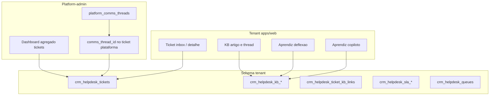

# Plano: módulo `crm-helpdesk` (CRM · setor TI)

## Alinhamento consolidado (suas respostas)

| Tema | Decisão |
|------|---------|
| Escopo MVP | Pacote **M11 completo** (tickets, KB, filas, SLA, prioridades, automações, CSAT) |
| Onde roda | **Tenant** (`apps/web`) com filtro por setor/departamento **+** painel agregado no **platform-admin** |
| Solicitante | **Pessoa** (`membershipId` / usuário) **+** **setor afetado** opcional (`sectorId`); ticket pode ser “para o setor” |
| Base de conhecimento | **Híbrido**: modo **artigo único** (problema + blocos de solução) **e** modo **thread** (post raiz + respostas, uma “solução aceita”) |
| Ticket ↔ KB | **N:N opcional**; sugestão na abertura/resolução |
| Aprendiz | **Deflexão** (solicitante) **+** **copiloto** (atendente no ticket) |
| Dependências | **Comms** (bridge plataforma no MVP); **sem** dependência obrigatória de `core-crm` |
| Operação | **Filas + SLA** no MVP |
| Comms MVP | **Bridge** `platform-comms` ↔ ticket (suporte plataforma); tickets tenant criados manualmente/UI |

## Contexto no monorepo

- Roadmap CRM já prevê M11 com entidades `ticket` e `kb_article` ([`.specs/002--crm-suite-roadmap--2026-05-22/plan.md`](.specs/002--crm-suite-roadmap--2026-05-22/plan.md)).
- Convenção de módulo: skill [`.cursor/skills/create-module/SKILL.md`](.cursor/skills/create-module/SKILL.md) — pacote em `modules/crm-helpdesk/`, registro em [`packages/module-registry/src/register-all.ts`](packages/module-registry/src/register-all.ts), tabelas prefixadas `crm_helpdesk_*` no schema tenant.
- **Aprendiz** já existe (`aprendiz`, setor `tecnologia`); engine atual é baseada em regras + LLM opcional ([`packages/aprendiz-engine/src/respond.ts`](packages/aprendiz-engine/src/respond.ts)) — precisará de **fonte de contexto** vinda da KB.
- **Comms hoje** é só schema `boilerplate` ([`PlatformCommsThread`](packages/db/prisma/schema.prisma)) — não há inbox tenant ainda; o MVP de comms = vínculo explícito thread ↔ ticket no platform-admin.



## Modelo de dados (tenant)

Prefixo: `crm_helpdesk_*` registrado em [`packages/db/src/module-migrations.ts`](packages/db/src/module-migrations.ts).

**Núcleo**

- `crm_helpdesk_tickets`
  - `id`, `number` (sequencial legível), `title`, `description`
  - `status`: `open` | `in_progress` | `waiting_requester` | `resolved` | `closed`
  - `priority`: `low` | `medium` | `high` | `urgent`
  - `requester_membership_id` (nullable se ticket “só setor”)
  - `affected_sector_id` (nullable)
  - `assignee_membership_id` (atendente)
  - `queue_id`
  - `sla_policy_id`, `sla_due_at`, `first_response_at`, `resolved_at`, `closed_at`
  - `branch_id` (opcional, alinhado a multi-loja)
  - auditoria: `created_by`, timestamps

- `crm_helpdesk_queues` — nome, `sector_id` opcional, regras de roteamento default, membros (`queue_membership`)

- `crm_helpdesk_sla_policies` — metas por prioridade (primeira resposta, resolução), horário útil (MVP: calendário simples seg–sex 9–18)

- `crm_helpdesk_ticket_comments` — timeline interna + notas para solicitante

- `crm_helpdesk_ticket_kb_links` — `(ticket_id, kb_entry_id, link_type: suggested|manual|resolved_from)`

**Base de conhecimento (híbrido)**

- `crm_helpdesk_kb_entries`
  - `kind`: `article` | `thread`
  - `title`, `problem_body` (markdown)
  - `status`: `draft` | `published` | `archived`
  - `tags[]`, `sector_ids[]` (filtro TI / outros setores)
  - para `article`: JSON `solutions[]` `{ id, title, body, order }`
  - para `thread`: post raiz em `problem_body`; soluções em tabela filha

- `crm_helpdesk_kb_posts` — usado quando `kind=thread` (respostas; flag `is_accepted_solution`)

- `crm_helpdesk_kb_search_chunks` (MVP Aprendiz) — texto flatten + `embedding` opcional ou **full-text** PostgreSQL na v1; evoluir para embeddings na fase 2

**CSAT e automação (M11)**

- `crm_helpdesk_csat_responses` — score + comentário pós-`closed`
- `crm_helpdesk_automation_rules` — gatilho (`ticket.created`, `sla.breached`, …) + ação (atribuir fila, notificar, sugerir KB) — MVP: 2–3 regras seed + UI mínima

**Platform (schema `boilerplate`) — extensão mínima**

- Coluna `platform_comms_threads.helpdesk_ticket_id` **ou** tabela `platform_helpdesk_ticket_refs` espelhando ticket tenant quando `organizationId` presente
- Decisão recomendada: ticket “plataforma” no global quando origem é comms de cliente; espelho read-only no agregado admin

## Eventos de domínio

Publicar via `@boilerplate/sdk-events` (alinhar [`packages/event-bus/src/catalog.ts`](packages/event-bus/src/catalog.ts)):

| Evento | Uso |
|--------|-----|
| `crm-helpdesk.ticket.created` | SLA clock, automações, timeline |
| `crm-helpdesk.ticket.assigned` | Notificação atendente |
| `crm-helpdesk.ticket.resolved` | Sugerir vínculo KB / promover thread→artigo |
| `crm-helpdesk.ticket.closed` | CSAT, `X-TL06` roadmap |
| `crm-helpdesk.kb.published` | Reindexar busca Aprendiz |

Consumidor **Aprendiz**: handler que atualiza índice de chunks (sem acoplamento direto ao Prisma do módulo — via API do módulo / evento).

## Integração Aprendiz

**Fase única no escopo acordado**, com implementação em camadas internas:

1. **Indexação** — ao publicar KB ou marcar solução aceita, gerar chunks + FTS (`tsvector`) no tenant.
2. **Copiloto (atendente)** — painel no detalhe do ticket: consulta `searchKb(query, { sectorId, limit })`, retorna trechos + links; UI envia trecho ao solicitante (comentário).
3. **Deflexão (solicitante)** — widget Aprendiz antes de criar ticket: se score de match > limiar, mostra solução; senão pré-preenche ticket com `suggested_kb_links`.
4. **LLM** — reutilizar `responderMensagemAprendizComLlm` passando `context.kbSnippets[]` no system prompt; fallback para FTS se LLM desligado.

Dependência de módulo: `dependencias: ["aprendiz"]` no registry; permissão `crm-helpdesk.read` para consulta KB.

## Integração comms (MVP)

- Em **platform-admin**: ação “Criar ticket” / “Vincular ticket” na thread [`CommsWorkspace`](apps/platform-admin/modules/platform-comms/comms-workspace.tsx).
- API server: `createTicketFromCommsThread(threadId)` → cria registro no contexto da `organizationId` da thread (provision tenant schema) + grava `comms_thread_id` no ticket.
- Mensagens futuras da thread podem append em `ticket_comments` (sync unidirecional MVP).

**Fora do MVP** (explícito): inbox omnichannel tenant (WhatsApp/webchat) — contrato de evento `comms.thread.linked` documentado na spec para S13+.

## UI e RBAC

**Tenant** — [`apps/web/app/(dashboard)/`](apps/web/app/(dashboard)/)

| Rota | Função |
|------|--------|
| `/helpdesk` | Inbox (filtros: fila, setor, status, meus tickets) |
| `/helpdesk/tickets/[id]` | Detalhe + copiloto Aprendiz + vínculos KB |
| `/helpdesk/kb` | Lista KB |
| `/helpdesk/kb/[id]` | Artigo ou thread |
| `/helpdesk/portal` (opcional) | Deflexão Aprendiz + abertura ticket (solicitante) |

Permissões sugeridas: `crm-helpdesk.read`, `crm-helpdesk.write`, `crm-helpdesk.assign`, `crm-helpdesk.kb.publish`, `crm-helpdesk.admin` (filas/SLA).

Filtro **multi-setor**: usar `Sector` / `MembershipSector` existentes no Prisma global + `sector_id` no ticket.

**Platform-admin** — página `/helpdesk` ou seção em org detail:

- KPIs: tickets abertos por org, SLA estourado, CSAT médio
- Lista cross-tenant (somente orgs com módulo ativo)
- Drill-down para ticket + link comms

## Registro do módulo

```typescript
// packages/module-registry/src/register-all.ts (conceitual)
scaffold("crm-helpdesk", "Help Desk TI", {
  routePath: "/helpdesk",
  sectorSlug: "tecnologia", // alinhado Aprendiz + estudo mercado TI
  camada: "Tática",
  faseMinima: 2,
  dependencias: ["aprendiz"],
  implementationStatus: "planned", // → implemented por marco
  navOrdem: 85,
});
```

Criar spec executável: [`.specs/008--crm-helpdesk-ti--2026-05-26/`](.specs/) com README, plano de sprints internos e critérios de aceite por item M11-01…07.

## Entrega em marcos (dentro do “M11 completo”)

Mesmo com escopo amplo, a ordem reduz risco de integração:

### Marco 1 — Fundação (2–3 sprints)
- Contrato módulo + migrations tenant + API tRPC/rotas
- CRUD tickets, solicitante + setor, atendente, comentários
- Filas + atribuição manual/automática básica
- UI inbox + detalhe tenant

### Marco 2 — KB híbrida (1–2 sprints)
- Artigo único + thread com solução aceita
- N:N ticket ↔ KB; sugestão na abertura (FTS)
- UI KB + promoção “fechar e publicar na KB”

### Marco 3 — SLA + CSAT + automações (1–2 sprints)
- Políticas SLA, relógio, alertas na UI
- CSAT pós-fechamento (e-mail/link ou in-app)
- 3 automações seed (criar→fila TI, SLA→escalar, resolver→sugerir KB)

### Marco 4 — Aprendiz + platform (1–2 sprints)
- Indexação + copiloto + deflexão
- Bridge platform-comms ↔ ticket
- Dashboard agregado platform-admin

### Marco 5 — Endurecimento
- Eventos timeline (`X-TL06`)
- Testes integração fila/SLA
- `syncRegistryToCatalog`, seed roadmap, docs [`doc/modulos/crm-suite/`](doc/modulos/crm-suite/)

## Riscos e mitigações

| Risco | Mitigação |
|-------|-----------|
| M11 completo de uma vez | Marcos acima com DoD por marco; spec 008 rastreia M11-01…07 |
| Comms só na plataforma | Bridge explícita no MVP; tenant manual; evento futuro documentado |
| Aprendiz sem RAG maduro | FTS PostgreSQL no MVP; embeddings como melhoria |
| KB dual (artigo + thread) | `kind` único em `kb_entries`; UI com seletor de modo na criação |
| Ticket cross-schema platform↔tenant | Ticket “espelho” global só para comms; fonte de verdade no tenant |

## Artefatos a produzir na implementação

- `modules/crm-helpdesk/` — contract, handlers, repositories (via SDK, sem Prisma direto no pacote)
- `packages/crm-helpdesk/` (opcional) — domínio compartilhado se UI platform precisar tipos
- Migrations tenant + registro tabelas
- Páginas web + platform-admin
- Extensão event-bus + handler Aprendiz
- Spec `.specs/008--crm-helpdesk-ti--2026-05-26/`

## Critérios de aceite (M11)

- [ ] Abrir ticket com solicitante + setor afetado opcional + fila + prioridade
- [ ] Atribuir atendente; filas por setor/time
- [ ] SLA calculado e visível; alerta quando estourar
- [ ] KB artigo e KB thread com solução aceita; publicar e buscar
- [ ] Vincular N artigos a um ticket; sugestão na abertura
- [ ] Aprendiz: deflexão antes do ticket + copiloto no detalhe
- [ ] CSAT após fechamento
- [ ] Criar/vincular ticket a partir de thread platform-comms
- [ ] Visão agregada no platform-admin por organização
