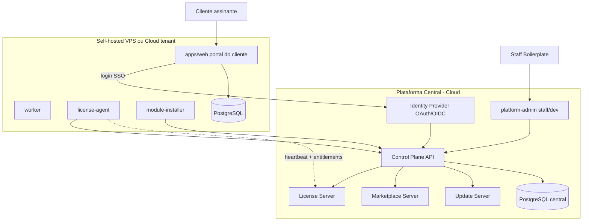
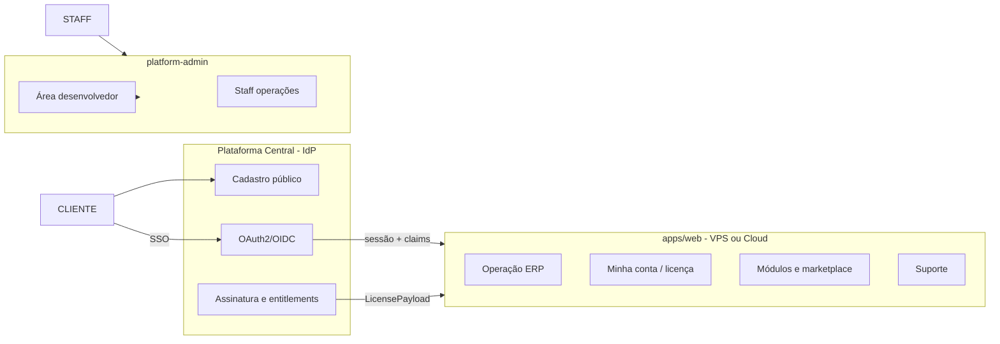
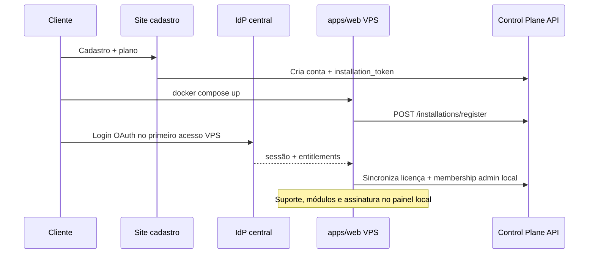

# Arquitetura híbrida Self-hosted — Boilerplate Enterprise

## Visão geral

Dois planos de controle separados, um codebase compartilhado:



**Princípio central (confirmado pelo cliente):**

| Camada | Onde vive | Papel |
|--------|-----------|-------|
| **Identidade e conta** | Plataforma central (IdP) | Cadastro, login, vínculo com assinatura e licença |
| **Funcionalidade operacional** | `apps/web` (VPS self-hosted ou cloud) | ERP, suporte, assinatura, marketplace de módulos — tudo na experiência do tenant |
| **Operação interna** | `platform-admin` | Somente staff, suporte interno e desenvolvedores — **cliente assinante não acessa** |

**Decisões confirmadas:**
- Cliente assinante usa **apenas** [`apps/web`](apps/web) para dia a dia (incluindo suporte, gestão de assinatura e aquisição de módulos).
- **Autenticação única** na plataforma central; a VPS/cloud só **concede acesso** às funcionalidades conforme `LicensePayload` da conta.
- Tenants **cloud (Vercel)** e **self-hosted** usam o **mesmo IdP central** (migração do auth local atual).
- Self-hosted suporta **multi-org com limites** da licença.

**Base reutilizável do repo:**
- Multi-tenant por schema: [`packages/db/src/tenant/provision.ts`](packages/db/src/tenant/provision.ts)
- Contratos SDK: [`packages/sdk-core`](packages/sdk-core) (`ModuleManifest`, `BoilerplateModule`, `satisfiesSemverRange`)
- Verificação Ed25519: [`packages/sandbox/src/manifest-verify.ts`](packages/sandbox/src/manifest-verify.ts)
- Migrations parciais: [`packages/db/src/module-migrations.ts`](packages/db/src/module-migrations.ts)
- Billing/entitlement implícito: `ModuloAtivo`, `provisioningStatus`, [`packages/db/src/billing-pricing.ts`](packages/db/src/billing-pricing.ts)
- CLI existente: [`packages/cli/bin/boilerplate.js`](packages/cli/bin/boilerplate.js)

---

## 1. Modelo de identidade — IdP central + portal no apps/web

### Separação clara: quem autentica onde



| Ator | Login | Interface principal |
|------|-------|---------------------|
| **Cliente assinante** | IdP central (OAuth) | [`apps/web`](apps/web) — ERP + `/conta`, `/modulos`, `/suporte` |
| **Colaborador do cliente** | IdP central (convite/membership) | `apps/web` — escopo da org tenant |
| **Staff Boilerplate** | `PlatformUser` credentials | [`platform-admin`](apps/platform-admin) apenas |
| **Desenvolvedor** | IdP central + flag `DeveloperAccount` | `platform-admin` área `/dev/*` apenas |

**Removido do escopo:** nav de cliente assinante no platform-admin (`/minha-conta`, `/marketplace` cliente, etc.).

### IdP central (hospedado junto ao Control Plane API)

Rotas em `apps/platform-admin/app/api/` ou novo `apps/identity` (Fase 1 pode ficar em platform-admin só API):
- `/.well-known/openid-configuration`
- `/oauth/authorize`, `/oauth/token`, `/oauth/userinfo`
- Cadastro público: `apps/marketplace` ou landing `/cadastro` → cria `User` + `PlatformCustomerAccount` + subscription

[`apps/web/auth.ts`](apps/web/auth.ts) migra para **OAuth client** do IdP (cloud e self-hosted):
- Provider NextAuth: `BoilerplateCentral` (OIDC)
- Claims na sessão: `centralUserId`, `customerAccountId`, `organizationId` (billing), `installationId?` (self-hosted)
- **Sem** credenciais locais como fonte de verdade (senha gerida no IdP; opcional cache de sessão local)

```ts
// packages/platform-api/src/session.ts
export interface CentralAccountSession {
  userId: string;
  customerAccountId: string;
  billingOrganizationId: string;
  installationId?: string;
  entitlements: string[]; // snapshot do último LicensePayload válido
}
```

### Portal do cliente dentro do apps/web

Nova área **Configurações → Conta da plataforma** (visível para `dono` / papéis com permissão `platform.account.manage`):

| Rota tenant | Função | Fonte de dados |
|-------------|--------|----------------|
| `/configuracoes/conta` | Plano, status assinatura, faturas, limites | API central `GET /billing/subscription` |
| `/configuracoes/licenca` | Entitlements ativos, uso vs limites, grace offline | `license-client` cache + refresh |
| `/configuracoes/modulos` | Catálogo instalável, instalar/atualizar módulo | API central marketplace + `module-installer` local |
| `/configuracoes/suporte` | Abrir ticket, histórico, anexos sanitizados | API central `POST /support/tickets` |
| `/configuracoes/atualizacoes` | Changelog, aplicar update (self-hosted) | `update-client` |

Todas as ações usam **token de usuário** (OIDC) + **installationKey** (machine, self-hosted) na chamada à API central. A UI filtra o catálogo: só exibe módulos/recursos presentes em `entitlements`.

### Bootstrap antes da VPS existir

Cliente **não** usa platform-admin. Fluxos aceitos:
1. **Site público** ([`apps/marketplace`](apps/marketplace) ou landing): cadastro + contratação + gera `installation_token`
2. **`install.sh`**: device code flow → login central no browser → token vinculado
3. **CLI** `boilerplate login` + `installation register`

### Fluxo self-hosted (primeira instalação)



---

## 2. Contratos TypeScript centrais

Novo pacote [`packages/platform-api`](packages/platform-api) — contratos compartilhados entre central, agents e CLI:

```ts
// packages/platform-api/src/installation.ts
export interface SelfHostedInstallation {
  id: string;
  organizationId: string;
  name: string;
  installationKey: string;
  publicUrl?: string;
  status: "pending" | "active" | "suspended" | "revoked";
  version: string;
  lastHeartbeatAt: Date;
  createdAt: Date;
  updatedAt: Date;
}

export interface InstallationHeartbeatPayload {
  installationId: string;
  platformVersion: string;
  installedModules: { id: string; version: string }[];
  installedIntegrators: { id: string; version: string }[];
  databaseVersion: string;
  dockerImageVersion: string;
  healthStatus: "healthy" | "degraded" | "unhealthy";
  lastMigrationStatus: "ok" | "failed" | "pending";
  orgCount: number;
  activeUserCount: number;
}
```

```ts
// packages/platform-api/src/license.ts
export interface LicensePayload {
  organizationId: string;
  installationId: string;
  plan: string;
  status: "active" | "past_due" | "expired" | "suspended";
  expiresAt: string;
  entitlements: string[];
  limits: { users: number; branches: number; modules: number; organizations: number };
  signature: string; // JWT RS256 ou Ed25519 sobre payload
  issuedAt: string;
  offlineGraceHours: number;
}
```

```ts
// packages/platform-api/src/marketplace.ts
export interface MarketplaceModule {
  id: string;
  name: string;
  description: string;
  type: "module" | "submodule" | "integrator";
  ownerDeveloperId?: string;
  status: "experimental" | "approved" | "recommended" | "official" | "enterprise";
  pricingModel: "free" | "subscription" | "usage" | "one_time";
  priceMonthlyCents?: number;
  currentVersion: string;
  minimumPlatformVersion: string;
  entitlementsRequired: string[];
  migrations: ModuleMigrationManifest[];
  changelog: ChangelogEntry[];
}

export interface ModuleMigrationManifest {
  moduleId: string;
  version: string;
  migrations: {
    id: string;
    checksum: string;
    direction: "up" | "down";
    tenantScoped: boolean;
    requiresBackup: boolean;
  }[];
}
```

```ts
// packages/platform-api/src/release.ts
export interface Release {
  id: string;
  targetType: "platform" | "module" | "integrator";
  targetId: string;
  version: string;
  compatibility: {
    minPlatformVersion: string;
    maxPlatformVersion?: string;
    sdkContractVersion: string;
  };
  changelog: string;
  migrations: string[];
  publishedBy: string;
  publishedAt: Date;
}
```

```ts
// packages/platform-api/src/support.ts
export interface SupportTicket {
  id: string;
  organizationId: string;
  installationId: string;
  moduleId?: string;
  integratorId?: string;
  type: "bug" | "question" | "configuration" | "billing" | "migration" | "performance";
  status: "open" | "triage" | "waiting_customer" | "waiting_developer" | "resolved";
  priority: "low" | "medium" | "high" | "critical";
  sanitizedContext: Record<string, unknown>;
}
```

Estender [`packages/sdk-core/src/contracts/marketplace.ts`](packages/sdk-core/src/contracts/marketplace.ts) para alinhar `ModuleManifest` com `MarketplaceModule` (checksum, migration manifest embutido).

---

## 3. Schema de banco — plataforma central

Adicionar ao [`packages/db/prisma/schema.prisma`](packages/db/prisma/schema.prisma):

| Modelo | Propósito |
|--------|-----------|
| `PlatformCustomerAccount` | Vínculo `User` ↔ org de billing; papéis customer |
| `SelfHostedInstallation` | Registro de VPS; status, version, heartbeat |
| `InstallationCredential` | Tokens OAuth/refresh criptografados (KEK existente) |
| `InstallationToken` | Token one-time de setup (hash, expiração) |
| `PlatformSubscription` | Plano, status, gateway ref (estende billing atual) |
| `EntitlementGrant` | Entitlements explícitos por org/installation |
| `MarketplaceListing` | Catálogo unificado (oficial + `EcosystemPublication`) |
| `ReleaseCatalog` | Versionamento platform/module/integrator |
| `DeveloperAccount` | Perfil dev, GitHub link, termos aceitos |
| `DeveloperRole` | owner/maintainer/contributor/support por módulo |
| `SupportTicket` + `SupportTicketMessage` | Suporte por módulo |
| `CustomerFeedback` | Feedback sanitizado do self-hosted |
| `GithubIssueLink` | Issue vinculada, labels, bounty |
| `InstallationEvent` | Audit: register, install, migration, update |

Campos sensíveis (`installationKey`, refresh tokens) via [`INTEGRATOR_ENCRYPTION_KEY`](packages/db/scripts/rotate-kek.ts) pattern já usado em `PlatformIntegratorCredential`.

---

## 4. Schema local — instalação self-hosted

Mesmo Prisma base + tabelas operacionais locais (DDL em [`packages/db/src/tenant/`](packages/db/src/tenant/) ou migration Prisma condicional):

```sql
-- schema boilerplate (global local)
installation_config (
  id, central_api_url, installation_id, installation_key_enc,
  oauth_client_id, oauth_refresh_token_enc, last_sync_at
)

license_cache (
  id, payload_json, signature, fetched_at, expires_at, valid_until
)

module_migrations_history (
  id uuid primary key,
  module_id text not null,
  migration_id text not null,
  version text not null,
  checksum text not null,
  status text not null,
  executed_at timestamp not null,
  error_message text null,
  UNIQUE(module_id, migration_id)
)

installed_modules (
  module_id, version, installed_at, source, manifest_checksum
)
```

Flag de ambiente: `DEPLOYMENT_MODE=cloud|self_hosted` — altera fonte de entitlements (gateway vs license-client).

---

## 5. Novos pacotes e serviços

| Pacote | Responsabilidade | Depende de |
|--------|------------------|------------|
| [`packages/platform-api`](packages/platform-api) | Contratos + client HTTP tipado | sdk-core |
| [`packages/license-server`](packages/license-server) | Resolver entitlements, assinar JWT, validar subscription | db, billing |
| [`packages/license-client`](packages/license-client) | Cache assinado, grace offline, gate de recursos | platform-api, sandbox |
| [`packages/module-migration-runner`](packages/module-migration-runner) | Checksum, histórico, tenant-scoped, backup gate | db, sdk-core |
| [`packages/module-installer`](packages/module-installer) | Download, verify, register, migrate, activate | license-client, migration-runner, module-registry |
| [`packages/update-client`](packages/update-client) | Platform + module updates, rollback | license-client, migration-runner |
| [`packages/update-server`](packages/update-server) | Releases, compat matrix, signed artifacts | db, platform-api |
| [`packages/feedback-bridge`](packages/feedback-bridge) | Sanitização + envio central + GitHub issue | platform-api |

**Serviço Docker `license-agent`** — thin wrapper Bun que roda [`packages/license-client`](packages/license-client) + heartbeat cron (a cada 5 min).

**Enforcement de licença** — middleware em [`apps/web/middleware.ts`](apps/web/middleware.ts) + `tenantProcedure` em [`apps/web/server/trpc/init.ts`](apps/web/server/trpc/init.ts):

```ts
// Regra crítica — nunca bloquear leitura/exportação
if (license.status === "expired") {
  block: ["module.install", "module.paid.write", "update.premium", "support.premium"];
  allow: ["data.read", "data.export", "auth.login"];
}
```

Reutilizar [`packages/db/src/activation.ts`](packages/db/src/activation.ts) `blocked` com enforcement real.

---

## 6. Control Plane API (central)

Rotas em [`apps/platform-admin/app/api/v1/`](apps/platform-admin/app/api/v1/):

| Método | Rota | Auth | Função |
|--------|------|------|--------|
| POST | `/installations/register` | installation_token | Registra VPS, retorna credentials |
| POST | `/installations/:id/heartbeat` | mTLS ou Bearer installationKey | Atualiza status + telemetria sanitizada |
| GET | `/license/:installationId` | installationKey | Payload assinado de entitlements |
| GET | `/marketplace/modules` | Bearer user OIDC ou installationKey | Catálogo filtrado por entitlements da conta |
| GET | `/billing/subscription` | Bearer user OIDC | Plano, faturas, limites (UI conta no apps/web) |
| POST | `/support/tickets` | Bearer user OIDC + installationId | Abrir/listar tickets (UI suporte no apps/web) |
| GET | `/marketplace/modules/:id/download` | installationKey + entitlement | Pacote tarball assinado |
| POST | `/installations/:id/events` | installationKey | Resultado install/migration/update |
| GET | `/updates/platform` | installationKey | Releases compatíveis |
| GET | `/updates/modules/:id` | installationKey | Versões disponíveis |
| POST | `/feedback` | installationKey | Feedback sanitizado |
| POST | `/oauth/token` | OAuth2 | Tokens para self-hosted |
| GET | `/.well-known/openid-configuration` | público | Discovery OIDC |

Implementação license-server como lib chamada pelas rotas — não microserviço separado na Fase 1.

---

## 7. Platform-admin — somente operação interna (sem portal do cliente)

[`apps/platform-admin`](apps/platform-admin) permanece com auth **`PlatformUser` apenas** (staff). Desenvolvedores autenticam via **IdP central** com claim `developerId` e acessam somente rotas `/dev/*`.

### A. Staff (visão operação)
- `/instalacoes` — instalações self-hosted, health, versões, migrations
- `/clientes` — contas assinantes (`PlatformCustomerAccount`), subscriptions
- `/licencas` — entitlements, revogação, override suporte
- `/suporte` — fila global de tickets (cliente **abriu** no apps/web)
- `/organizacoes` — tenants cloud existentes
- `/comunidade` — moderação

### B. Desenvolvedor (visão restrita)
- `/dev/modulos`, `/dev/receita`, `/dev/suporte`, `/dev/issues`
- Sem dados operacionais de tenant, sem `installationKey`, sem dumps

### C. O que o cliente faz no apps/web (não no platform-admin)

| Necessidade do cliente | Onde |
|----------------------|------|
| Login / senha / 2FA | IdP central (redirect OAuth) |
| Ver plano e pagar | `apps/web` → `/configuracoes/conta` |
| Instalar módulo pago | `apps/web` → `/configuracoes/modulos` |
| Abrir suporte | `apps/web` → `/configuracoes/suporte` |
| Ver licença e limites | `apps/web` → `/configuracoes/licenca` |
| Operar ERP | `apps/web` rotas tenant existentes |

Staff responde tickets no platform-admin; cliente acompanha status no apps/web (polling ou webhook leve para atualizar status local).

---

## 8. Module installer e migration runner

Pipeline unificado:

```mermaid
flowchart LR
  A[Consultar marketplace] --> B[Verificar entitlement]
  B --> C[Verificar semver compat]
  C --> D[Download pacote]
  D --> E[verifyManifestSignature]
  E --> F[Registrar installed_modules]
  F --> G[migration-runner]
  G --> H[registerModuleTables + onInstall]
  H --> I[Atualizar ModuloAtivo local]
  I --> J[Reportar evento à central]
```



**module-migration-runner** evolui [`packages/db/src/module-migrations.ts`](packages/db/src/module-migrations.ts):
- Substituir `fromVersion: "0.0.0"` hardcoded por manifest versionado
- Checksum SHA256 por migration SQL/arquivo
- `tenantScoped: true` → loop em todos `tenant_*` ativos
- `requiresBackup: true` → exige snapshot flag antes de executar
- Idempotência via `module_migrations_history`
- Community modules: **somente** migrations declaradas no manifest — SQL livre proibido (lint + runtime guard)

Wire `onInstall`/`onUninstall` do contrato [`BoilerplateModule`](packages/sdk-core/src/contracts/module.ts) no fluxo de ativação.

---

## 9. Update system

**update-server** (central): publica releases em `ReleaseCatalog`, artifacts no storage (S3/Vercel Blob), assinatura Ed25519.

**update-client** (local):
1. Poll `/updates/platform` e `/updates/modules/:id`
2. Verifica licença + compat (`satisfiesSemverRange`)
3. Download + verify signature
4. Backup recomendado (pg_dump hook)
5. Apply migrations via runner
6. Rolling restart via docker compose
7. Rollback se migration falhar (down migrations quando existirem)

UI: painel em `apps/web/app/configuracoes/atualizacoes` (self-hosted; cloud recebe notificação de update gerenciado pela Boilerplate).

---

## 10. Docker e distribuição

Novo diretório [`dist/self-hosted/`](dist/self-hosted/) (ou `infra/self-hosted/`):

```
dist/self-hosted/
├── docker-compose.yml      # web, worker, postgres, redis, license-agent
├── Dockerfile.web
├── Dockerfile.worker
├── Dockerfile.license-agent
├── .env.example
├── install.sh              # curl -fsSL https://install.boilerplate.com.br | bash
├── install.ps1
└── README-self-hosted.md
```

Serviços mínimos:
- **web** — `apps/web` com `DEPLOYMENT_MODE=self_hosted`
- **worker** — BullMQ jobs (migrations batch, heartbeat fallback)
- **postgres** — reutiliza imagem de [`infra/docker/docker-compose.yml`](infra/docker/docker-compose.yml)
- **redis** — filas + cache license
- **license-agent** — heartbeat + license refresh

Build: novo target Turbo `build:self-hosted` produz imagens versionadas (`boilerplate/web:1.2.0`).

---

## 11. CLI

Estender [`packages/cli/bin/boilerplate.js`](packages/cli/bin/boilerplate.js):

```bash
boilerplate login                    # device code → conta central
boilerplate installation register    # vincula token
boilerplate license status           # mostra cache + entitlements
boilerplate modules install <id>     # via module-installer
boilerplate modules update <id>
boilerplate update [--platform|--module <id>]
boilerplate doctor                   # health: DB, license, migrations, central reachability
```

Comandos delegam para pacotes workspace via `Bun.spawn`.

---

## 12. Suporte, feedback e GitHub

**SupportTicket** — criado no self-hosted com contexto sanitizado (versões, módulos, stack trace truncado, sem PII operacional).

Roteamento:
- Ticket sem `moduleId` → fila platform suporte
- Com `moduleId` comunitário → notifica `DeveloperRole` com role `owner|maintainer|support`
- Desenvolvedor vê contexto técnico; cliente vê status simplificado

**Feedback → Issue GitHub:**
1. Cliente envia feedback no self-hosted
2. [`packages/feedback-bridge`](packages/feedback-bridge) sanitiza (remove CPF, valores, nomes)
3. Platform-admin triagem (+ sugestão IA opcional Fase 5)
4. Admin aprova → GitHub API cria issue com labels obrigatórias:
   `module:*`, `integrator:*`, `processo:*`, `phase:*`, `impacto:*`, `tipo:*`, `origem:cliente`, `status:triagem`, `bounty:*`
5. Vincula `GithubIssueLink` ao módulo/roadmap

---

## 13. Skills para desenvolvedores (vibe coding)

Estrutura em [`.cursor/skills/`](.cursor/skills/) — espelhar padrão de [`create-module`](.cursor/skills/create-module/SKILL.md):

```
.cursor/skills/
├── create-module-migration/
├── create-marketplace-listing/
├── create-support-diagnostics/
├── create-github-issue-from-feedback/
├── release-module-version/
└── review-community-pr/
```

Cada SKILL.md: objetivo, quando usar, entradas, arquivos permitidos/proibidos, padrões, comandos teste, checklist, exemplos, erros comuns. Reforçar: community **nunca** importa `@boilerplate/db`.

---

## 14. Segurança — regras obrigatórias

| Regra | Implementação |
|-------|---------------|
| Tokens criptografados | KEK + `InstallationCredential` |
| HTTPS only | `central_api_url` validado, HSTS |
| Pacotes assinados | Reutilizar Ed25519 de [`manifest-verify.ts`](packages/sandbox/src/manifest-verify.ts) |
| Migrations checksum | SHA256 no manifest, rejeitar mismatch |
| Logs sanitizados | `feedback-bridge` + redaction middleware |
| Dev sem acesso a DB cliente | RBAC + API sem endpoints de dump |
| Suporte remoto | consent flag explícito por sessão |
| Metadados vs operacional | heartbeat só telemetria agregada |
| Revogação | `status: revoked` → license-agent invalida cache |
| Rotação de chaves | endpoint `/installations/:id/rotate-key` + CLI |

CI existente ([`lint:ecosystem`](package.json)) expandir com:
- `check:license-contracts` — schemas platform-api
- `check:migration-manifests` — checksums presentes
- `check:self-hosted-compose` — compose válido, imagens buildam

---

## 15. Plano de implementação incremental

### Fase 1 — Fundação self-hosted (4–6 semanas)
- `DEPLOYMENT_MODE` + env profile self-hosted
- Prisma: `SelfHostedInstallation`, `InstallationToken`, `PlatformCustomerAccount`, `PlatformSubscription`, `EntitlementGrant`
- **IdP OAuth2/OIDC** (API central) + **apps/web como OAuth client** (cloud + self-hosted)
- platform-admin: mantém só `PlatformUser`; sem login de cliente
- Cadastro público + geração `installation_token` (marketplace/landing)
- Control Plane API: register, heartbeat, license, billing/subscription (read)
- `packages/platform-api`, `packages/license-server`, `packages/license-client`
- Docker compose self-hosted + `install.sh`
- **apps/web:** `/configuracoes/licenca` (leitura entitlements)
- CLI: `installation register`, `license status`, `doctor`
- **DoD parcial:** login central no VPS, licença cacheada, admin vinculado à conta oficial

### Fase 2 — Marketplace licenciado (3–4 semanas)
- `MarketplaceListing` + API download assinado
- `packages/module-installer`
- Entitlement gate em rotas/APIs pagas
- **apps/web:** `/configuracoes/modulos` (catálogo + instalar) e `/configuracoes/conta` (assinatura)
- [`apps/marketplace`](apps/marketplace) permanece catálogo **público** (marketing); aquisição no apps/web autenticado
- **DoD:** cliente instala módulo autorizado pelo painel da VPS, sem acessar platform-admin

### Fase 3 — Migrations de módulos (3–4 semanas)
- `packages/module-migration-runner` completo
- `ModuleMigrationManifest` em releases
- Wire `onInstall`/`onUninstall`
- Histórico + rollback parcial
- Enforcement: community só via runner
- **DoD:** migration tenant-scoped com checksum e histórico

### Fase 4 — Platform-admin avançado + suporte bilateral (3–4 semanas)
- Platform-admin staff: instalações, health, migration failures, fila suporte
- **apps/web:** `/configuracoes/suporte` completo (abrir ticket, histórico, anexos sanitizados)
- `SupportTicket` + roteamento por módulo (cliente cria no web, staff/dev responde no platform-admin)
- Dashboard telemetria agregada (staff only)
- **DoD:** cliente abre suporte na VPS; staff atende no platform-admin; status sincroniza no web

### Fase 5 — Comunidade e GitHub (4 semanas)
- `DeveloperAccount`, `DeveloperRole`, área `/dev/*`
- `packages/feedback-bridge` + triagem + GitHub issues
- Bounties, revenue share, changelog público
- Skills oficiais em `.cursor/skills/`
- **DoD:** feedback vira issue; dev gerencia módulos

### Fase 6 — Update server (3 semanas)
- `ReleaseCatalog`, `packages/update-server`, `packages/update-client`
- UI atualizações + CLI `boilerplate update`
- Rollback + compat matrix
- **DoD:** update platform/module pelo painel e CLI

---

## 16. Definition of Done (global)

Checklist alinhado ao pedido original — validar ao final da Fase 6:

- [ ] Instalação Docker funcional com `install.sh`
- [ ] Registro via conta oficial + installation_token
- [ ] Admin central vinculado à instalação local
- [ ] License server libera/bloqueia recursos (sem bloquear leitura)
- [ ] Marketplace central + install local autorizado
- [ ] Migrations seguras com histórico e checksum
- [ ] Cliente: suporte, assinatura e módulos no apps/web (auth central)
- [ ] Platform-admin: somente staff, dev e suporte interno
- [ ] Tickets vinculados a módulos
- [ ] Feedback → issue GitHub estruturada
- [ ] Versionamento independente (platform/module/integrator/SDK)
- [ ] Update-client operacional
- [ ] RBAC impede vazamento de dados entre atores
- [ ] CI valida segurança, SDK, migrations, ecosystem

---

## Riscos e mitigações

| Risco | Mitigação |
|-------|-----------|
| Migração auth apps/web para OIDC | Feature flag `AUTH_MODE=central|legacy`; rollout cloud + self-hosted |
| Cliente confunde platform-admin com portal | platform-admin bloqueia login de `User` não-staff; redirect para apps/web |
| Billing cloud vs self-hosted | `DEPLOYMENT_MODE` switch; subscription central é fonte de verdade |
| Migrations community perigosas | Runner único + lint + sandbox quotas |
| Offline prolongado | Grace period configurável; cache assinado |
| Multi-org excede limites | Gate em `createOrganizationWithTenant()` checando `limits.organizations` |
