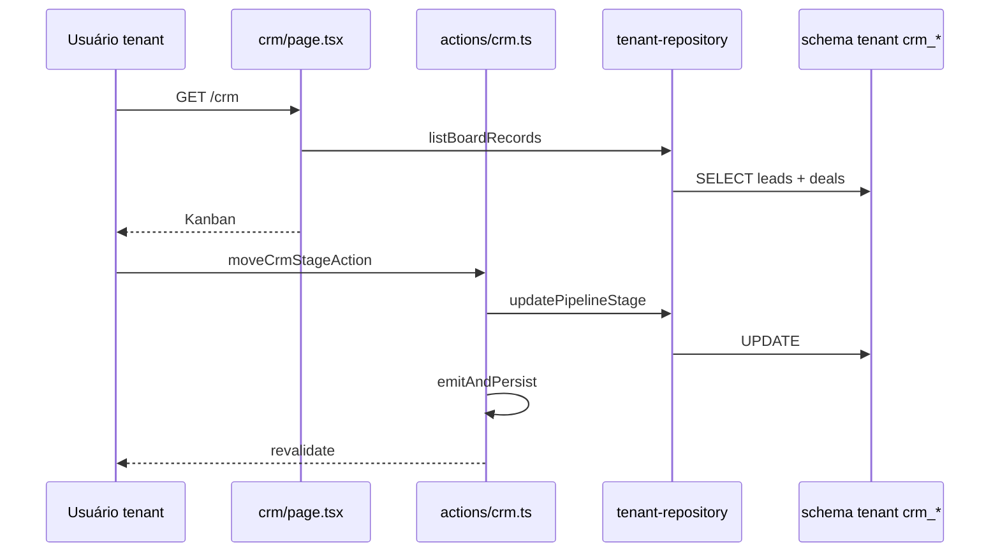

# Plano — core-crm Pipeline MVP (Sprint S04)

> Parte do [roadmap CRM Suite](../002--crm-suite-roadmap--2026-05-22/sprints.md#s04--pipeline-mvp-tenant--gestão-lead-básica-§12-fase-1--m1m2-subset).  
> Duração alvo: **1–2 semanas**. Depende de `core-clientes` implemented (já está).  
> Itens do backlog: M1-G01, G08, G09, M2-K01 — ver [backlog](../002--crm-suite-roadmap--2026-05-22/backlog-funcionalidades.md).

## Objetivo

Substituir o scaffold de `createTenantCrmRepository` por persistência real em `crm_*`, expor UI em `/crm` no `apps/web`, e alinhar permissões/eventos ao restante do monorepo.

## Abordagem (ordem de implementação)

1. **Tipos e estágios tenant** em `packages/crm` (pipeline comercial ≠ pipeline SaaS da plataforma).
2. **Repositório** `tenant-repository.ts` com SQL raw (mesmo padrão de `clients.ts`).
3. **Ajuste `crm-ui`** — props opcionais para estágios/labels (não quebrar `platform-crm`).
4. **Server Actions** + página + client board.
5. **RBAC, nav, registry, eventos**.
6. **Smoke manual** + CI.

---

## Pipeline comercial (MVP)

Estágios fixos no código (configurável em spec futura `007`):

| `pipeline_stage` | Label UI |
|------------------|----------|
| `prospect` | Prospect |
| `qualificado` | Qualificado |
| `proposta` | Proposta |
| `negociacao` | Negociação |
| `ganho` | Ganho |
| `perdido` | Perdido |

Default ao criar lead: `prospect`. Default ao criar deal sem estágio: `qualificado`.

**Mapeamento no board (`CrmBoardRecord`):**

| Origem DB | `kind` | `id` no card | `title` |
|-----------|--------|--------------|---------|
| `crm_lead` | `lead` | `crm_lead.id` | `name` |
| `crm_deal` + join cliente | `organization` | `crm_deal.id` | nome do cliente |

> Reutiliza `CrmRecordKind` do pacote compartilhado para compatibilidade com `crm-ui`, sem renomear tipos nesta sprint.

**Campos opcionais no card (`meta`):** `email`, `phone`, `clientId`, `dealValueCents` (futuro), `createdAt`.

**Fase (`phase`):** usar `1` fixo no MVP (vista “por fase” desligada ou oculta no tenant).

---

## Arquivos e pastas (escopo)

| Caminho | Ação | Notas |
|---------|------|--------|
| `packages/crm/src/types.ts` | alterar | `TenantCrmPipelineStage`, constantes, type guard |
| `packages/crm/src/tenant-pipeline.ts` | criar | `TENANT_CRM_PIPELINE_STAGES`, labels PT |
| `packages/crm/src/index.ts` | alterar | exports |
| `packages/crm-ui/src/crm-board.tsx` | alterar | props `pipelineStages?`, `stageLabels?`, default SaaS |
| `packages/crm-ui/src/crm-kanban.tsx` | alterar | consumir stages injetados |
| `packages/db/src/crm/tenant-repository.ts` | alterar | implementação completa (substituir fake clients) |
| `packages/db/src/crm/tenant-crm-sql.ts` | criar | helpers INSERT/SELECT (opcional, reduz ruído no repo) |
| `packages/db/src/index.ts` | alterar | export funções CRM tenant se necessário |
| `packages/shared/src/events/domain-event-bus.ts` | alterar | tipos `crm.lead.criado`, `crm.deal.criado`, `crm.deal.etapa_alterada`, `crm.nota.criada` |
| `apps/web/app/(dashboard)/crm/page.tsx` | criar | Server Component, lista records |
| `apps/web/app/actions/crm.ts` | criar | mutations + `requireTenantContext` |
| `apps/web/components/crm/tenant-crm-board-client.tsx` | criar | wrapper `CrmBoard` + actions |
| `apps/web/lib/rbac.ts` | alterar | `/crm` para vendedor; `MODULE_ROUTE_PREFIX["core-crm"]` |
| `apps/web/lib/module-permissions.ts` | alterar | matriz `core-crm` (ver/registrar/editar) |
| `apps/web/lib/command-palette/build-items.ts` | alterar | atalho CRM se módulo ativo |
| `apps/web/components/app-sidebar.tsx` | alterar | ícone distinto (ex. `Kanban`) |
| `packages/module-registry/src/register-all.ts` | alterar | `implemented`, `depthCurrent: 2` |
| `prd.md` | alterar | linha status `core-crm` quando concluir |
| `.specs/002--crm-suite-roadmap--2026-05-22/README.md` | alterar | link para 004 em andamento |

**Não criar** `apps/web/modules/core-crm/` — o repo usa `app/actions` + `components/` (igual `clientes`, não `platform-admin/modules`).

---

## Modelo de dados (tenant)

Tabelas já criadas em `provision.ts` / `ensureTenantCrmTables`:

```sql
crm_lead (id, name, email, phone, pipeline_stage, estimated_phase, ...)
crm_deal (id, client_id, crm_lead_id, phase, pipeline_stage, ...)
crm_note (id, body, client_id, crm_lead_id, ...)
crm_activity (id, activity_type, body, client_id, ...)  -- fora do MVP UI
```

### Alterações SQL (se necessário na sprint)

| Alteração | Motivo |
|-----------|--------|
| `ALTER` adicionar `title TEXT` em `crm_deal` | opcional — MVP usa nome do cliente |
| `ALTER` adicionar `value_cents INTEGER` em `crm_deal` | **fora** do MVP |
| Índice `(client_id)` em `crm_deal` | performance listagem |

Sem migration Prisma global — apenas DDL idempotente em `ensureTenantCrmTables` (padrão tenant).

### Integridade

- `client_id` em `crm_deal` deve existir em `clients` (validar no repositório antes de INSERT).
- Notas: XOR lógico — `crm_lead_id` **ou** `client_id` / deal ref (usar `crm_lead_id` ou `client_id` conforme `kind` do card).
- Deletar cliente com deals: MVP **bloquear** ou deals órfãos — preferir bloquear com erro PT-BR.

---

## API / UI

### Server Actions (`apps/web/app/actions/crm.ts`)

| Action | Entrada | Efeito |
|--------|---------|--------|
| `listCrmBoardAction` | — | `CrmBoardRecord[]` via repo |
| `moveCrmStageAction` | `id`, `kind`, `stage` | UPDATE stage + evento |
| `createCrmLeadAction` | `{ name, email?, phone? }` | INSERT lead + evento |
| `createCrmDealAction` | `{ clientId, crmLeadId? }` | INSERT deal + evento |
| `loadCrmNotesAction` | `id`, `kind` | notas |
| `addCrmNoteAction` | `id`, `kind`, `body` | INSERT note + evento |

Todas:

```ts
const ctx = await requireTenantContext();
await ensureTenantCrmTables(ctx.schemaName);
```

`revalidatePath("/crm")` após mutação.

### Permissões

| Papel | Ver `/crm` | Criar/editar |
|-------|------------|--------------|
| dono | sim | sim |
| gerente | sim | sim |
| vendedor | sim | sim |
| operador | não | não |
| financeiro | não | não |

Registrar em `MODULE_PERMISSION_MATRIX` e `ROUTES_BY_ROLE.vendedor` incluir `"/crm"`.

### Página `/crm`

- Card título: **CRM Comercial**
- Descrição: pipeline de leads e oportunidades
- `CrmBoard` com `initialView="pipeline"` apenas (ocultar toggle fase no tenant via prop `allowedViews?: CrmBoardView[]` em `crm-ui` — opcional MVP: passar só pipeline e esconder tabs no client)
- Form criar lead (reutilizar `CreateLeadForm` do sheet ou botão no board)
- Dialog criar oportunidade: select cliente (`listClientsAction`)

### Módulo ativo

Respeitar `activeModuleIds` do layout — middleware existente de módulo bloqueado deve aplicar a `/crm` (verificar `lib/modules` / guard de rota; se ausente, checar padrão de `/clientes`).

---

## Eventos (`domain_events`)

| Tipo | Payload mínimo |
|------|----------------|
| `crm.lead.criado` | `{ leadId, name }` |
| `crm.deal.criado` | `{ dealId, clientId, leadId? }` |
| `crm.deal.etapa_alterada` | `{ dealId, from, to }` |
| `crm.nota.criada` | `{ noteId, targetKind, targetId }` |

Registrar em `core-crm` no `module-registry` (`eventosPublicados`) quando o tipo existir no define-module.

---

## Alterações em `crm-ui` (contrato)

```ts
export interface CrmBoardProps {
  // existentes...
  pipelineStages?: CrmPipelineStage[]; // tenant pode passar TenantCrmPipelineStage[] cast
  stageLabels?: Record<string, string>;
  allowedViews?: CrmBoardView[]; // default: todas
}
```

`platform-crm` **não** passa props → comportamento atual preservado.

---

## Repositório tenant — métodos

Implementar `CrmRepository` em `createTenantCrmRepository(schemaName)`:

| Método | Comportamento |
|--------|---------------|
| `listBoardRecords` | UNION leads + deals com nome cliente |
| `updatePipelineStage` | UPDATE `crm_lead` ou `crm_deal` |
| `updatePhase` | no-op ou throw “não suportado” no tenant MVP |
| `listNotes` / `addNote` | `crm_note` filtrado por lead_id ou deal→client |
| `createLead` | INSERT `crm_lead` |
| `createDeal?` | estender interface em `packages/crm` ou action chama SQL direto — **preferir** estender `CrmRepository` com `createDeal?` opcional |

---

## Testes e verificação

### Automatizado

- [ ] `bun run ci`
- [ ] Typecheck `packages/crm`, `packages/crm-ui`, `apps/web`

### Manual (tenant de dev)

1. Login como dono, org com `core-crm` ativo no setor comercial.
2. Abrir `/crm` — board vazio ou com seed.
3. Criar lead “Empresa X” → coluna Prospect.
4. Mover para Qualificado → refresh mantém posição.
5. Cliente em `/clientes` “João Ltda” → criar oportunidade → card em Qualificado.
6. Abrir card → adicionar nota → reaparece na lista.
7. Login vendedor — mesmo fluxo.
8. Login operador — `/crm` bloqueado ou 403.

### Seed (opcional)

Adicionar em seed tenant demo 1 lead + 1 deal — documentar no README da spec ao concluir.

---

## Tarefas da sprint (checklist dev)

| # | Tarefa | Estimativa |
|---|--------|------------|
| 1 | Tipos + tenant pipeline constants | 2h |
| 2 | `tenant-repository` CRUD + list board | 6h |
| 3 | `crm-ui` props stages/views | 3h |
| 4 | `actions/crm.ts` + eventos | 3h |
| 5 | Página + `tenant-crm-board-client` | 4h |
| 6 | RBAC + permissions + palette | 2h |
| 7 | module-registry + prd | 1h |
| 8 | QA manual + CI | 2h |

**Total ~23h**

---

## Riscos

| Risco | Mitigação |
|-------|-----------|
| `CrmPipelineStage` tipado só para SaaS | Tipos separados tenant + cast na UI tenant |
| `[modulo]` captura `/crm` antes da página dedicada | Rota explícita `(dashboard)/crm/page.tsx` tem precedência no App Router |
| Deals sem valor/previsão | Aceitar MVP; campos na spec 007 |

---

## Checklist de conclusão

- [ ] Todos critérios de aceite do README marcados
- [ ] README `004` → `status: completed`
- [ ] `002` README — T1 referenciado como done
- [ ] `prd.md` — `core-crm` implemented, D≥2
- [ ] `module_depth_changelog` se o projeto usar changelog de profundidade

---

## Diagrama (fluxo MVP)


