# Arquitetura da Plataforma Boilerplate

> Diagramas e visão estrutural do monorepo **Boilerplate Enterprise** — gestão empresarial modular, multi-tenant, com marketplace de extensões.
>
> **Atualizado:** Maio 2026 · **Complementos:** [`CONTEXTO.md`](../../CONTEXTO.md) · [`prd.md`](../../prd.md) · [`doc/ecosystem/README.md`](../ecosystem/README.md)

---

## 1. Visão geral do produto

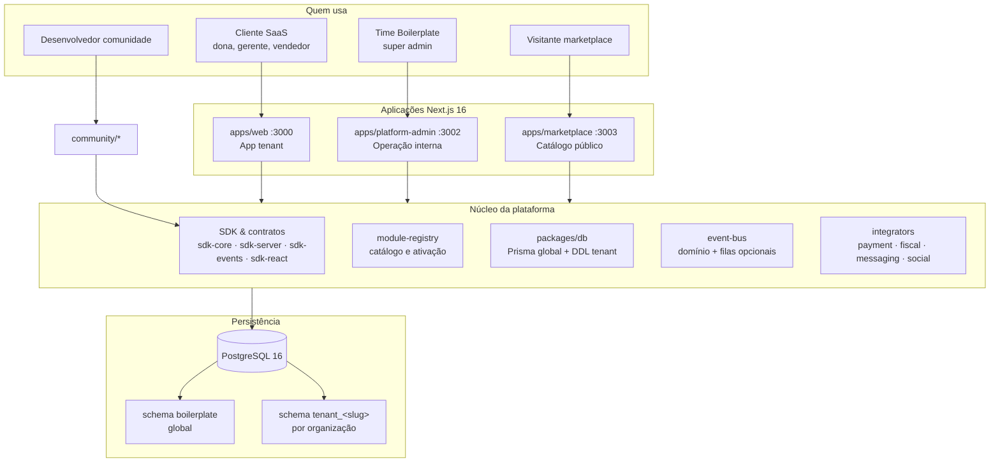

| Dimensão | Decisão |
|----------|---------|
| **Produto** | ERP modular + Aprendiz IA + extensões comunitárias |
| **Isolamento** | Schema PostgreSQL **por tenant** (não só RLS) |
| **Extensibilidade** | Módulos oficiais + `community/*` governados por contratos |
| **Integrações** | Sempre via **integradores** — módulos não chamam APIs externas direto |
| **Runtime** | Bun + Turborepo · env centralizado na raiz do monorepo |

---

## 2. Monorepo — mapa de workspaces

Workspaces definidos em `package.json` raiz: `apps/*`, `packages/*`, `community/*`, `modules/*`.

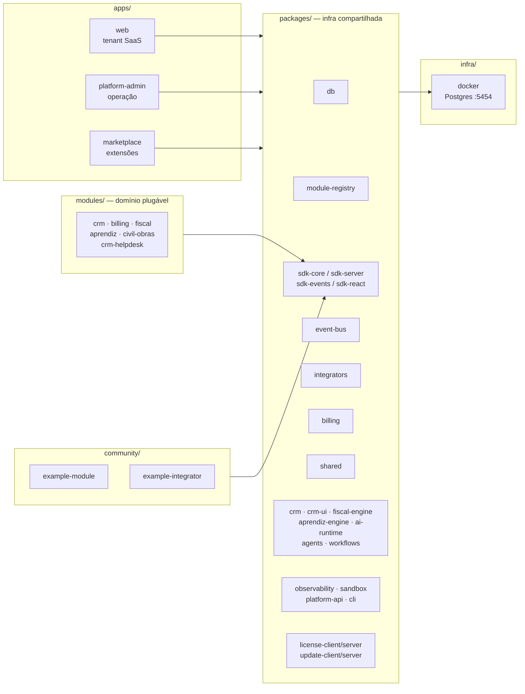

### Papel de cada camada de pasta

| Pasta | Responsabilidade |
|-------|------------------|
| **`apps/web`** | UI e rotas do **cliente** (`/vendas`, `/crm`, `/catalogo`…), tRPC, Server Actions, auth tenant (NextAuth) |
| **`apps/platform-admin`** | CRM da plataforma, orgs, módulos/planos, integradores, segmentos, roadmap, moderação comunidade |
| **`apps/marketplace`** | Vitrine pública de extensões aprovadas |
| **`packages/*`** | Bibliotecas reutilizáveis — **não** são telas |
| **`modules/*`** | Pacotes de domínio com contrato `BoilerplateModule` (instaláveis / versionáveis) |
| **`community/*`** | Contribuições externas (PR + moderação antes de produção) |
| **`infra/docker`** | Postgres local para desenvolvimento |

---

## 3. Arquitetura em camadas

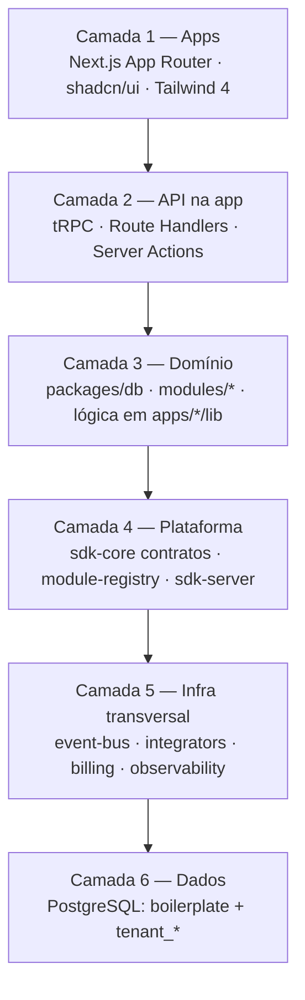

### Princípios (invariantes)

1. **Schema por tenant** desde o dia 1 — dados operacionais isolados em `tenant_<slug>`.
2. **Entidades core não duplicadas** — `Cliente`, `Item`, `Venda` são estendidas, não reimplementadas por módulo.
3. **Comunicação por eventos de domínio** — handlers síncronos no MVP; BullMQ/Redis quando `REDIS_URL` está configurado.
4. **Integradores como única porta externa** — pagamento, fiscal, e-mail, WhatsApp, webhooks.
5. **Contratos versionados** em `@boilerplate/sdk-core` — oficiais e comunidade seguem as mesmas regras.
6. **Módulos comunitários** não importam `@boilerplate/db` diretamente — usam `sdk-server` / `sdk-events`.

---

## 4. Fluxo de uma requisição (app tenant)

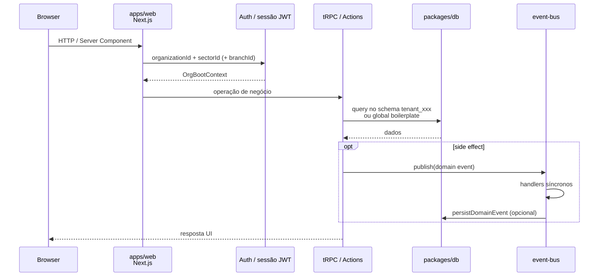

**Bootstrap no servidor** (`apps/web/lib/modules/init-server.ts`):

1. `ensureModulesRegistered()` — catálogo em `module-registry`
2. `configureCredentialResolver()` — credenciais de integradores (BYOK / platform)
3. `initEventBus()` — bus + persistência + OTEL opcional
4. `registerDomainEventHandlers()` — reações entre módulos (ex.: venda → fluxo de caixa)

---

## 5. Modelo multi-tenant e acesso

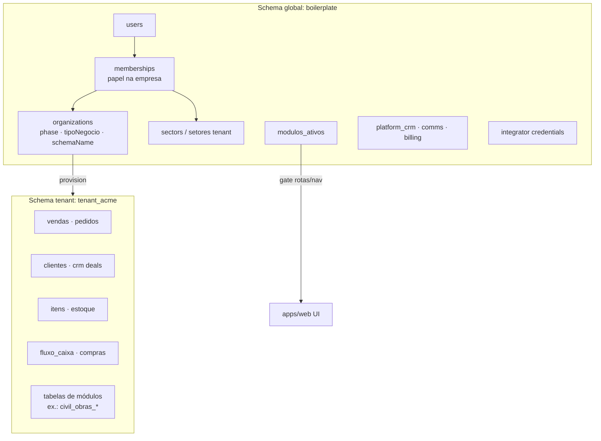

### Cadeia de autorização

```
Usuário
  └── Membership (empresa + papel: dono, gerente, vendedor…)
        └── Acesso por setor (subset de módulos / nav / permissões)
              └── Dados operacionais no schema tenant_xxx
```

Sessão JWT exige: `organizationId` + `sectorId` (+ `branchId` quando multi-loja).

| Nível | Schema | Exemplos de conteúdo |
|-------|--------|----------------------|
| **Global** | `boilerplate` | orgs, planos, catálogo de módulos, CRM plataforma, credenciais integradores |
| **Tenant** | `tenant_<slug>` | vendas, estoque, CRM do cliente, compras, tabelas de módulos instalados |

- Prisma: `packages/db/prisma/schema.prisma` (**somente** global)
- DDL tenant: `packages/db/src/tenant/` + `bun run db:migrate-tenants`

---

## 6. Sistema de módulos

Dois registros complementares:

| Mecanismo | Onde | Função |
|-----------|------|--------|
| **Metadados de produto** | `packages/module-registry` (`register-all.ts`) | Nav, rotas, fase, setor, profundidade D, dependências, status scaffold/implemented |
| **Contrato runtime** | `packages/sdk-core` → `BoilerplateModule` | Capabilities, permissions, routes, eventHandlers, migrations, onInstall |

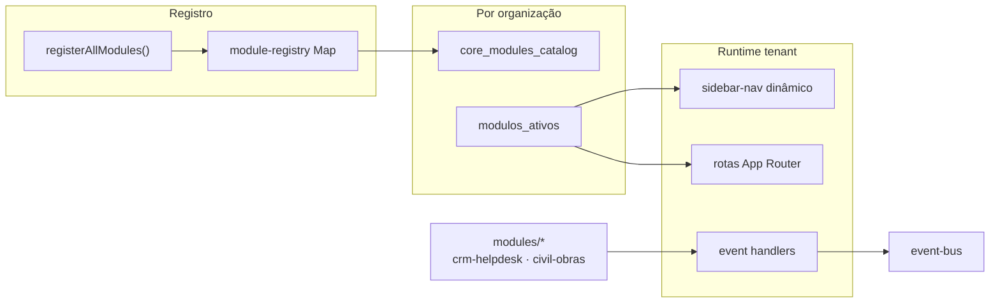

### Hierarquia fiscal (exemplo de módulo pai ↔ filhos)

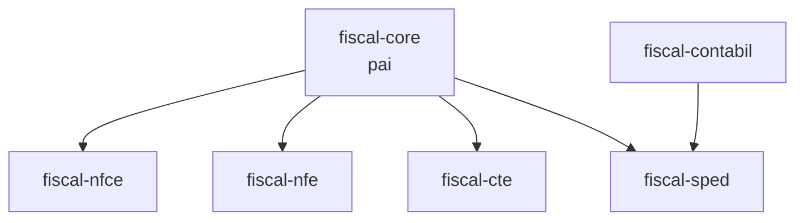

Módulos **implementados** no tenant incluem: `core-catalogo`, `core-clientes`, `core-crm`, `core-vendas`, `core-pedidos`, `core-estoque-basico`, `fin-fluxo-caixa`, `ops-compras`, `aprendiz`, etc. (lista completa em [`CONTEXTO.md` §7](../../CONTEXTO.md)).

Pacotes em `modules/` com lógica própria: `civil-obras`, `crm-helpdesk`, `crm`, `fiscal`, `billing`, `aprendiz`.

---

## 7. Barramento de eventos

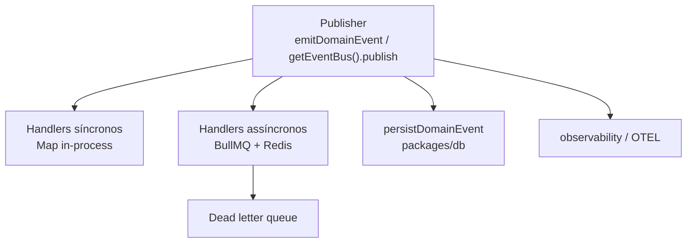

| Pacote | Papel |
|--------|-------|
| `@boilerplate/event-bus` | Implementação atual (registerHandler, publish, versão de evento, fila opcional) |
| `@boilerplate/shared` … `domain-event-bus` | Ponte legada → redireciona para event-bus |
| `@boilerplate/sdk-events` | API para módulos registrarem handlers sem acoplar ao db |

**Exemplos de eventos:** `venda.confirmada`, `crm.deal.etapa_alterada`, `ordem_compra.criada`, `civil-obras.entrada.publicada`, `crm-helpdesk.ticket.created`.

**Padrão clássico:** `venda.confirmada` → lançamento automático no fluxo de caixa.

---

## 8. Integradores (camada anti-corrupção externa)

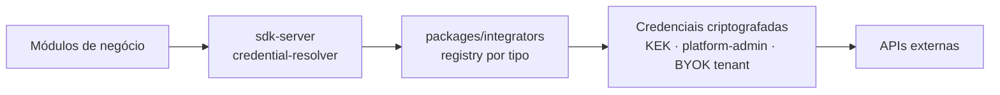

| Tipo | Exemplos | Status típico |
|------|----------|----------------|
| `payment` | mock, asaas, stripe (scaffold) | cobrança / assinatura |
| `fiscal` | noop, focus-nfe (planned) | NFC-e / NF-e |
| `messaging` | resend-mock, resend (planned) | e-mail transacional |
| `social` | whatsapp-mock, meta (planned) | WhatsApp / Telegram |
| `webhook` | generic (planned) | HTTP normalizado |

Catálogo de produto: `packages/db/data/platform-catalog.json`.  
Módulos **nunca** embutem SDK de Stripe/Focus direto — passam pelo adapter registrado.

---

## 9. Três aplicações — comparação

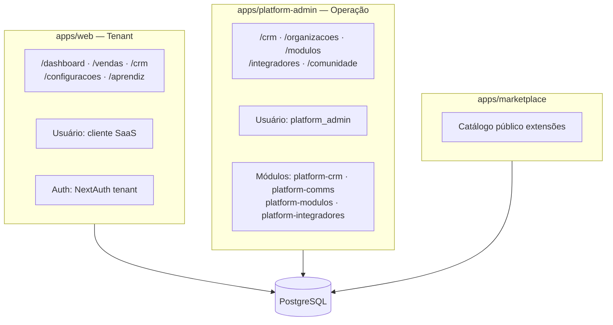

| App | Porta | Schema principal |
|-----|-------|------------------|
| **web** | 3000 | `tenant_*` + leitura global (módulos ativos, billing) |
| **platform-admin** | 3002 | `boilerplate` (CRM plataforma, provisioning) |
| **marketplace** | 3003 | Metadados públicos de publicações aprovadas |

### Dois CRMs (não confundir)

| Nome | Onde | O quê |
|------|------|-------|
| **CRM Plataforma** | `platform-crm` no admin | Funil SaaS: lead → trial → organização |
| **CRM Comercial** | `core-crm` no tenant | Pipeline do negócio do cliente |
| **Cadastro** | `core-clientes` | Base operacional — não substitui CRM |

---

## 10. SDK — dependências entre pacotes

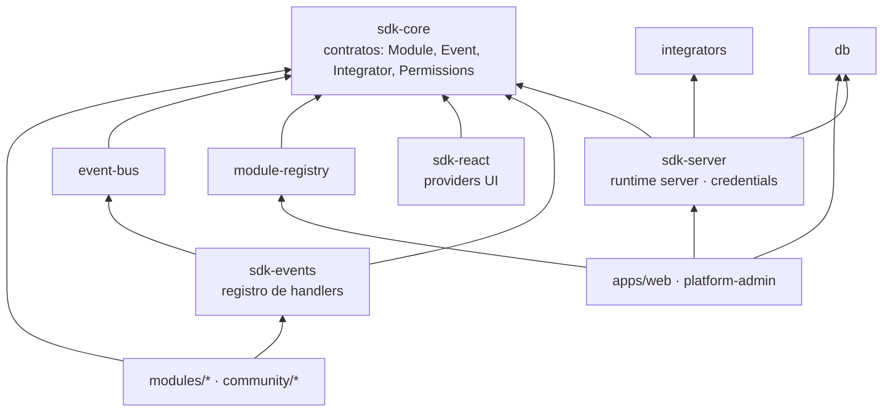

**Capabilities** do módulo (`BoilerplateModule`): `database`, `queues`, `webhooks`, `billing`, `ai`, `externalHttp` — com bloqueios explícitos: `filesystem: false`, `crossTenant: false`.

---

## 11. Ecossistema comunitário

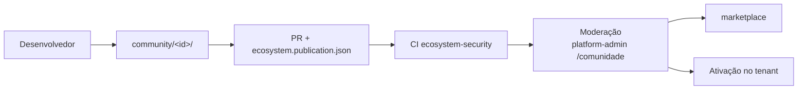

Documentação: [`doc/ecosystem/publicacao-pr-comunidade.md`](../ecosystem/publicacao-pr-comunidade.md).

**Sandbox** (`packages/sandbox`): execução isolada para código comunitário antes de confiar em produção.

---

## 12. Deploy e ambientes

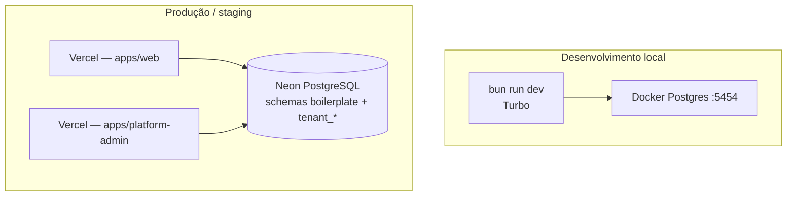

- Env **somente na raiz** (`.env`, `.env.development`, `.env.local`) — apps não têm `.env` próprio.
- Gate local: `bun run ci` / `bun run check:vercel`
- Docs: [`doc/vercel/README.md`](../vercel/README.md)

Modo **self-hosted** híbrido: pacotes `license-*`, `update-*`, scripts em `packages/db/src/self-hosted/`.

---

## 13. Pacotes de domínio e motores especializados

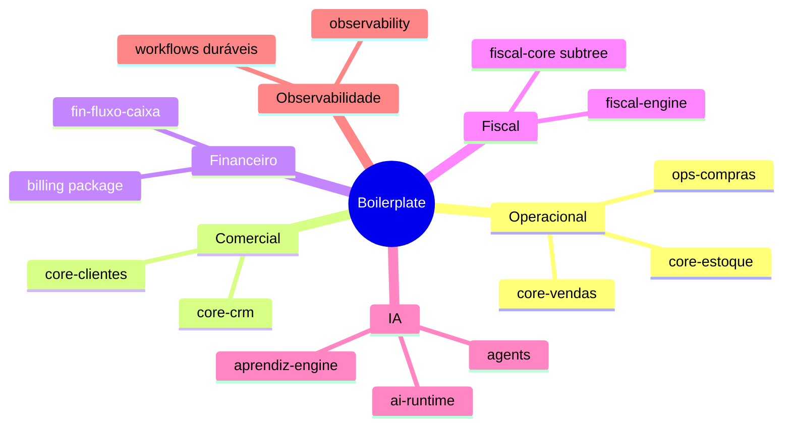

| Pacote | Função |
|--------|--------|
| `fiscal-engine` | Motor de emissão fiscal plugável |
| `aprendiz-engine` | Missões, automações, ensino de processos |
| `ai-runtime` / `agents` | LLM e agentes |
| `workflows` | Orquestração durável (WDK / long-running) |
| `billing` | PricingEngine + adapters de pagamento |
| `crm` + `crm-ui` | Domínio e componentes CRM tenant |
| `platform-api` | Contratos e client HTTP para APIs de plataforma / setup |

---

## 14. Glossário rápido de escalas

| Sigla | Significado |
|-------|-------------|
| **R0–R4** | Marco de **entrega** de engenharia |
| **P1–P4** | **Fase de produto** do tenant (`organizations.phase`) |
| **E0–E10** | **Estágio de evolução** do negócio do cliente |
| **D0–D5** | **Profundidade** do módulo (quão completo vs. alvo) |

Detalhe: [`.specs/_shared/glossary.md`](../../.specs/_shared/glossary.md).

---

## 15. Onde ir mais fundo

| Tópico | Documento |
|--------|-----------|
| Contexto executivo e catálogo de módulos | [`CONTEXTO.md`](../../CONTEXTO.md) |
| PRD completo | [`prd.md`](../../prd.md) |
| Publicação comunidade | [`doc/ecosystem/`](../ecosystem/README.md) |
| CRM suite | [`doc/modulos/crm-suite/crm.md`](../modulos/crm-suite/crm.md) |
| Variáveis Vercel | [`doc/vercel/environment-variables.md`](../vercel/environment-variables.md) |
| Criar módulo (skill) | [`.cursor/skills/create-module/SKILL.md`](../../.cursor/skills/create-module/SKILL.md) |
| Criar integrador (skill) | [`.cursor/skills/create-integrator/SKILL.md`](../../.cursor/skills/create-integrator/SKILL.md) |

---

## 16. Comandos que materializam a arquitetura

```bash
bun run db:up                 # Postgres local
bun run db:push               # schema global (boilerplate)
bun run db:migrate-tenants    # DDL em todos tenant_*
bun run dev                   # web :3000 + platform-admin :3002 + marketplace :3003
bun run ci                    # pipeline local (espelha GitHub Actions)
```

Este arquivo é **descritivo** — reflete o estado do repositório; mudanças estruturais devem atualizar os diagramas aqui ou em `CONTEXTO.md` §6–9.
