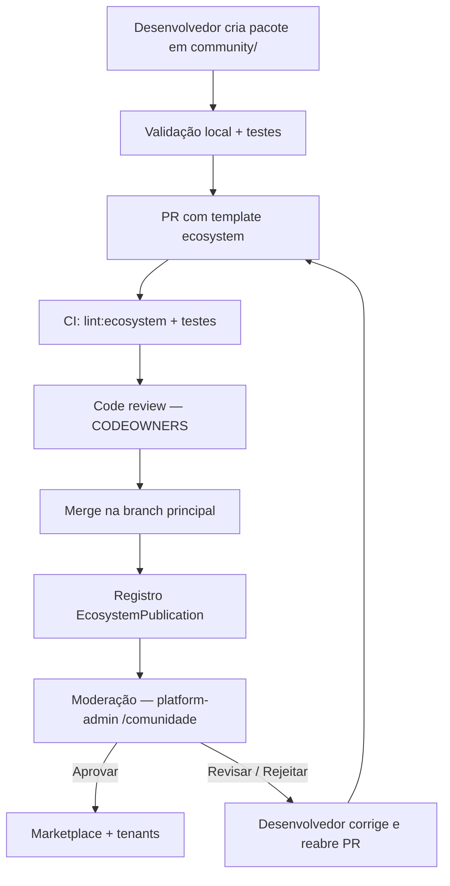
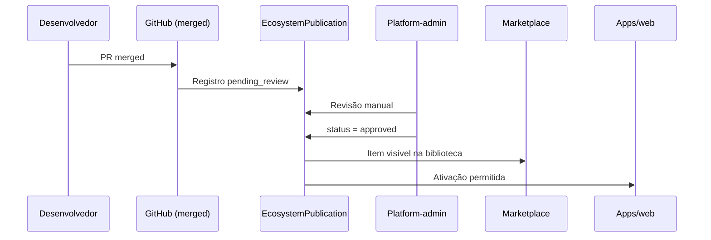

# Guia de publicação na comunidade — PR padronizada

Este documento descreve **como desenvolvedores externos e internos** devem propor módulos e integradores para o ecossistema Boilerplate Enterprise, de forma que o time da plataforma possa **auditar**, **moderar** e **liberar** o uso pelos tenants com segurança.

> **Escopo:** contribuições em `community/` via Pull Request no monorepo.  
> Para pacotes npm externos (`@boilerplate-community/*` sem PR), consulte a seção [Publicação externa](#publicação-externa-npm).

---

## Índice

1. [Visão geral do fluxo](#1-visão-geral-do-fluxo)
2. [Pré-requisitos](#2-pré-requisitos)
3. [Escolha: módulo ou integrador](#3-escolha-módulo-ou-integrador)
4. [Estrutura obrigatória do pacote](#4-estrutura-obrigatória-do-pacote)
5. [Guia: módulo da comunidade](#5-guia-módulo-da-comunidade)
6. [Guia: integrador da comunidade](#6-guia-integrador-da-comunidade)
7. [Metadados de publicação](#7-metadados-de-publicação)
8. [Regras de segurança (obrigatórias)](#8-regras-de-segurança-obrigatórias)
9. [Validação local antes da PR](#9-validação-local-antes-da-pr)
10. [Abrindo a Pull Request](#10-abrindo-a-pull-request)
11. [O que a auditoria verifica](#11-o-que-a-auditoria-verifica)
12. [Após merge: moderação e rollout na plataforma](#12-após-merge-moderação-e-rollout-na-plataforma)
13. [Respondendo a ajustes solicitados](#13-respondendo-a-ajustes-solicitados)
14. [Publicação externa (npm)](#14-publicação-externa-npm)
15. [FAQ](#15-faq)
16. [Referências](#16-referências)

---

## 1. Visão geral do fluxo



| Etapa | Responsável | Resultado |
|-------|-------------|-----------|
| Implementação | Desenvolvedor | Pacote em `community/<id>/` |
| PR + CI | Desenvolvedor + GitHub Actions | Código validado estaticamente |
| Code review | `@boilerplate/core-team` | Aprovação técnica do diff |
| Moderação | Produto / Engenharia (platform-admin) | Libera ou devolve com comentários |
| Rollout | Plataforma | Item visível no marketplace e utilizável pelos tenants |

**Importante:** merge na PR **não** libera uso automático pelos tenants. Todo item da comunidade passa por **moderação** em `/comunidade` no platform-admin antes de `availableToTenants = true`.

---

## 2. Pré-requisitos

### Ambiente local

```bash
# Na raiz do monorepo
bun install
bun run db:up          # PostgreSQL (porta 5454)
bun run db:generate
bun run db:push
```

Variáveis: copie `.env.example` → `.env` e `.env.development` conforme [README.md](../../README.md).

### Ferramentas

| Ferramenta | Uso |
|------------|-----|
| [Bun](https://bun.sh) 1.2+ | Runtime, testes, scripts |
| Git + fork do repositório | PR via GitHub |
| `bunx create-boilerplate-module` | Scaffold de módulo (opcional) |
| `boilerplate publish` | Gera manifesto assinado (recomendado) |

### Conhecimento mínimo

- TypeScript e contratos em `@boilerplate/sdk-core`
- Leitura dos exemplos: `community/example-module/` e `community/example-integrator/`
- Skills internas (Cursor): `.cursor/skills/create-module/` e `.cursor/skills/create-integrator/`

---

## 3. Escolha: módulo ou integrador

| Tipo | Quando usar | Pasta | Pacote npm |
|------|-------------|-------|------------|
| **Módulo** | UI, rotas, eventos, dados de negócio no tenant | `community/<module-id>/` | `@boilerplate-community/<module-id>` |
| **Integrador** | Conexão com serviço externo (pagamento, mensageria, fiscal…) | `community/<integrator-id>/` | `@boilerplate-community/<integrator-id>` |

### Convenções de ID

- **Formato:** kebab-case (`meu-modulo`, `payment-acme`, `messaging-sendgrid`)
- **Único** no ecossistema (não colidir com ids em `modules/` ou `platform-catalog.json`)
- **Permissões de módulo:** `<id>.read`, `<id>.write`
- **Tabelas tenant:** prefixo `{moduleId}_` (ex.: `example_module_items`)

### Zonas do repositório

| Zona | Caminho | Quem pode PR |
|------|---------|--------------|
| Core | `packages/core`, `packages/sdk-*` | Core team |
| Oficial | `modules/`, `packages/integrators/` | Maintainers |
| **Comunidade** | **`community/`** | **Qualquer contribuidor (este guia)** |

---

## 4. Estrutura obrigatória do pacote

Todo pacote em `community/<id>/` deve conter:

```
community/<id>/
├── README.md                    # Propósito, setup, limitações
├── package.json                 # name: @boilerplate-community/<id>
├── tsconfig.json
├── ecosystem.publication.json   # Metadados para moderação (obrigatório)
├── src/
│   ├── index.ts                 # Export público
│   ├── contract.ts              # Módulo: BoilerplateModule
│   │   ou index.ts              # Integrador: BoilerplateIntegrator
│   └── contract.test.ts         # Testes mínimos do contrato
└── dist/
    └── manifest.json            # Gerado por `boilerplate publish` (recomendado)
```

Copie o template de metadados:

```bash
cp community/ecosystem.publication.template.json community/<seu-id>/ecosystem.publication.json
```

---

## 5. Guia: módulo da comunidade

### 5.1 Scaffold

```bash
# Na raiz do monorepo
bunx create-boilerplate-module meu-modulo
# Mover para community/ se o CLI criou na raiz:
# mv meu-modulo community/meu-modulo
```

Ou copie `community/example-module/` e renomeie ids, permissões e rotas.

### 5.2 Contrato (`src/contract.ts`)

Implemente `BoilerplateModule`:

```typescript
import type { BoilerplateModule } from "@boilerplate/sdk-core";
import { mergeCapabilities } from "@boilerplate/sdk-core";

export const moduleContract: BoilerplateModule = {
  id: "meu-modulo",
  version: "0.1.0",
  coreContract: "^1.2.0",
  segment: ["ecommerce"],           // segmentos alvo
  capabilities: mergeCapabilities({
    database: true,
    queues: true,
    // filesystem, processEnv, crossTenant devem permanecer false
  }),
  requiredPermissions: ["meu-modulo.read", "meu-modulo.write"],
  routes: [
    { path: "/meu-modulo", label: "Meu Módulo", permission: "meu-modulo.read" },
  ],
  eventHandlers: [
    {
      eventType: "meu-modulo.item.created",
      eventVersion: "^1.0.0",
      handlerId: "meu-modulo-on-item-created",
      async: true,
      moduleId: "meu-modulo",
    },
  ],
};
```

Referência: [community/example-module/src/contract.ts](../../community/example-module/src/contract.ts)

### 5.3 Event handlers (opcional)

Se houver handlers assíncronos, implemente em `src/handlers.ts` seguindo o exemplo em `community/example-module/src/handlers.ts`. Registre tipos de evento em `packages/event-bus/src/catalog.ts` **somente se forem eventos novos** — isso exige menção explícita na PR.

### 5.4 Tabelas tenant

1. Declare tabelas em `packages/db/src/module-migrations.ts`:

```typescript
registerModuleTables("meu-modulo", [
  { name: "meu_modulo_items", description: "Itens do meu módulo" },
]);
```

2. Implemente migrations com `registerModuleMigrations("meu-modulo", [...])` se houver DDL.
3. Prefixo obrigatório: `{moduleId}_` no nome lógico da tabela.

### 5.5 UI tenant (se aplicável)

Módulos com interface no dashboard tenant exigem alterações em `apps/web/` (rotas, componentes). **Mantenha a PR focada:** prefira UI mínima ou documente integração manual na PR se a UI for grande (PRs separados podem ser combinados após auditoria do contrato).

### 5.6 Testes mínimos

```typescript
// src/contract.test.ts
import { describe, expect, test } from "bun:test";
import { moduleContract } from "./contract";

describe("meu-modulo contract", () => {
  test("capabilities seguras", () => {
    expect(moduleContract.id).toBe("meu-modulo");
    expect(moduleContract.capabilities.filesystem).toBe(false);
    expect(moduleContract.capabilities.processEnv).toBe(false);
    expect(moduleContract.capabilities.crossTenant).toBe(false);
  });
});
```

### 5.7 Checklist — módulo

- [ ] Id kebab-case único
- [ ] `BoilerplateModule` com `coreContract: "^1.2.0"`
- [ ] Capabilities explícitas; sem `filesystem` / `processEnv` / `crossTenant`
- [ ] Permissões declaradas e usadas onde houver UI/actions
- [ ] Eventos com `eventVersion` semver
- [ ] Tabelas com prefixo `{moduleId}_` + `registerModuleTables`
- [ ] Sem import de `@boilerplate/db` no pacote community
- [ ] `ecosystem.publication.json` preenchido
- [ ] `README.md` com propósito e como testar
- [ ] `bun test` passando no pacote

---

## 6. Guia: integrador da comunidade

### 6.1 Scaffold

Copie `community/example-integrator/` para `community/<seu-integrador>/` e adapte.

### 6.2 Contrato

Implemente `BoilerplateIntegrator`:

```typescript
import type { BoilerplateIntegrator, MessagingAdapter } from "@boilerplate/sdk-core";

export const meuIntegrador: BoilerplateIntegrator<MessagingAdapter> = {
  id: "messaging-acme",
  version: "0.1.0",
  category: "messaging",  // payment | messaging | fiscal | storage | social | webhook
  configSchema: [
    { key: "apiKey", label: "API Key", type: "secret", required: true },
    { key: "fromEmail", label: "Remetente", type: "string", required: true },
  ],
  capabilities: { externalHttp: true },
  healthCheck: async (creds) => {
    if (!creds.secrets.apiKey) {
      return { ok: false, code: "MISSING_KEY", message: "apiKey obrigatória" };
    }
    return { ok: true, latencyMs: 50 };
  },
  adapter: meuAdapter,
};
```

Referência: [community/example-integrator/src/index.ts](../../community/example-integrator/src/index.ts)

### 6.3 Catálogo da plataforma

Adicione entrada em `packages/db/data/platform-catalog.json`:

```json
{
  "id": "messaging-acme",
  "label": "Acme Messaging",
  "tipo": "messaging",
  "provider": "Acme Inc.",
  "description": "Envio de e-mail transacional via API Acme.",
  "implementationStatus": "implemented",
  "modulosSuportados": ["*"],
  "packagePath": "community/messaging-acme",
  "deliveryMarco": null,
  "ordem": 200,
  "gateway": {
    "isDefault": false,
    "ativo": true,
    "configSchema": {
      "fields": [
        { "key": "apiKey", "label": "API Key", "type": "secret", "required": true },
        { "key": "fromEmail", "label": "Remetente", "type": "string", "required": true }
      ]
    }
  }
}
```

**Regra:** campos em `gateway.configSchema.fields` devem ser **idênticos** ao `configSchema` do código.

### 6.4 Pagamentos (integradores `payment-*`)

Se a categoria for pagamento, documente na PR:

- Rota de webhook: `apps/web/app/api/webhooks/payment/[integratorId]/route.ts`
- Idempotência e validação de assinatura do webhook
- Comportamento em sandbox vs produção

### 6.5 Checklist — integrador

- [ ] Id kebab-case com prefixo de categoria quando possível (`payment-*`, `messaging-*`)
- [ ] `BoilerplateIntegrator` com `healthCheck` funcional
- [ ] `configSchema` alinhado ao `platform-catalog.json`
- [ ] Sem `process.env` — credenciais via `ResolvedCredentials`
- [ ] Entrada em `platform-catalog.json`
- [ ] `ecosystem.publication.json` com `kind: "integrator"` e `category`
- [ ] Testes do contrato / healthCheck mock
- [ ] `bun run lint:ecosystem` passando

---

## 7. Metadados de publicação

Arquivo **`ecosystem.publication.json`** na raiz do pacote (copie de [community/ecosystem.publication.template.json](../../community/ecosystem.publication.template.json)):

```json
{
  "kind": "module",
  "externalId": "meu-modulo",
  "name": "Meu Módulo",
  "description": "Descrição curta para marketplace e moderação.",
  "publisherName": "Sua Empresa ou Nome",
  "publisherEmail": "dev@empresa.com",
  "packageName": "@boilerplate-community/meu-modulo",
  "packagePath": "community/meu-modulo",
  "category": null,
  "segmentosAlvo": ["ecommerce"],
  "modulosSuportados": null,
  "dependencias": [],
  "riscosConhecidos": "",
  "instrucoesRollout": "Registrar tabelas em module-migrations; moderação em /comunidade."
}
```

Para integradores, preencha `category` (`messaging`, `payment`, etc.) e `modulosSuportados` (`["*"]` ou lista de módulos).

Após merge, a plataforma usa esses metadados para criar/atualizar o registro **`EcosystemPublication`** (moderação em platform-admin → **Comunidade**).

---

## 8. Regras de segurança (obrigatórias)

Enforced por ESLint (`eslint.ecosystem.config.mjs`) e CI:

| Regra | Motivo |
|-------|--------|
| **Proibido** `@boilerplate/db` em `community/` | Isolamento; use `@boilerplate/sdk-server` |
| **Proibido** `process.env` | Config injetada pelo core |
| **Proibido** `NEXT_PUBLIC_*` em módulos | Sem vazamento de config no client |
| Capabilities declaradas = uso real | Sandbox bloqueia violações |
| Tabelas prefixadas `{moduleId}_` | Evita colisão entre módulos |
| Sem acesso cross-tenant | `crossTenant: false` sempre |

### Trust levels

| Nível | Significado |
|-------|-------------|
| `community` | Submissão inicial; quotas restritas no sandbox |
| `verified` | Aprovado pela moderação |
| `certified` | Auditoria ampliada (futuro) |
| `official` | Mantido pelo core (`modules/`) |

Contribuições via PR começam como **`community`** e passam a **`verified`** após aprovação em `/comunidade`.

### Manifesto assinado (recomendado)

```bash
cd community/meu-modulo
bun ../../packages/cli/bin/boilerplate.js publish .
# Gera dist/manifest.json — inclua na PR
```

---

## 9. Validação local antes da PR

Execute **na raiz do monorepo**:

```bash
# Lint de segurança do ecossistema
bun run lint:ecosystem

# Testes do seu pacote
bun run --filter @boilerplate-community/meu-modulo test

# Typecheck do pacote
bun run --filter @boilerplate-community/meu-modulo lint

# (Opcional) Dev com exemplos da comunidade
bun run dev:community

# Auditoria de dependências
bun audit --audit-level=high
```

Confirme que **nenhum** arquivo fora de `community/<seu-id>/` foi alterado sem necessidade (exceto `module-migrations.ts`, `platform-catalog.json`, `event-bus/catalog.ts` quando aplicável).

---

## 10. Abrindo a Pull Request

### Branch

```bash
git checkout -b ecosystem/meu-modulo
git add community/meu-modulo packages/db/src/module-migrations.ts
git commit -m "feat(community): adiciona módulo meu-modulo"
git push -u origin ecosystem/meu-modulo
```

### Template

No GitHub, selecione o template **Ecosystem** (`.github/PULL_REQUEST_TEMPLATE/ecosystem.md`) ou copie a seção abaixo na descrição.

### Título sugerido

```
feat(community): <tipo> <id> — <resumo curto>
```

Exemplos:

- `feat(community): module meu-modulo — catálogo complementar`
- `feat(community): integrator messaging-acme — e-mail transacional`

### Descrição mínima (copie e preencha)

```markdown
## Resumo

<!-- O que este módulo/integrador faz e para quem -->

## Tipo

- [ ] Módulo (`community/<id>/`)
- [ ] Integrador (`community/<id>/`)

## Metadados

| Campo | Valor |
|-------|-------|
| ID | `meu-modulo` |
| Pacote | `@boilerplate-community/meu-modulo` |
| Versão | `0.1.0` |
| Publicador | Nome / e-mail |

## Arquivos tocados fora de community/

<!-- Liste: module-migrations.ts, platform-catalog.json, etc. e justifique -->

## Segurança

- [ ] Sem `@boilerplate/db` no pacote community
- [ ] Sem `process.env`
- [ ] Capabilities conferidas
- [ ] Tabelas prefixadas (módulos)
- [ ] configSchema = platform-catalog (integradores)

## Testes locais

- [ ] `bun run lint:ecosystem`
- [ ] `bun run --filter @boilerplate-community/<id> test`
- [ ] `bun audit --audit-level=high`

## Rollout pós-merge

<!-- O que o time da plataforma precisa fazer após aprovar em /comunidade -->

## Screenshots / evidências

<!-- Opcional: healthCheck, UI, logs de teste -->
```

### Labels sugeridas

`ecosystem`, `community`, `module` ou `integrator`

---

## 11. O que a auditoria verifica

### CI automático (`.github/workflows/ecosystem-security.yml`)

- `bun run lint:ecosystem`
- Testes `@boilerplate/sdk-core`
- Testes do example-module (referência)
- Sync de capabilities no exemplo
- `bun audit --audit-level=high`

### Code review (humanos — CODEOWNERS `/community/`)

| Área | Perguntas |
|------|-----------|
| **Contrato** | Compatível com `coreContract`? Permissões mínimas? |
| **Segurança** | Credenciais só via BYOK? Webhooks validados? |
| **Dados** | Migrations seguras? Prefixo de tabelas? |
| **Escopo** | PR focada? Sem refactors não relacionados? |
| **Catálogo** | JSON consistente com código? |
| **Docs** | README e `ecosystem.publication.json` claros? |

### Moderação (platform-admin → Comunidade)

Após merge técnico, operadores da plataforma:

1. Conferem metadados e manifesto
2. **Aprovam** → item no marketplace + disponível para tenants
3. **Solicitam ajustes** → comentário obrigatório ao desenvolvedor
4. **Rejeitam** → com justificativa registrada em auditoria

---

## 12. Após merge: moderação e rollout na plataforma



### Ações do time da plataforma (checklist interno)

- [ ] Verificar registro em **Comunidade** (`/comunidade`)
- [ ] Validar `ecosystem.publication.json` vs código merged
- [ ] Rodar smoke test em staging (se existir)
- [ ] **Aprovar** ou devolver com `reviewNotes`
- [ ] Comunicar desenvolvedor (issue/PR/discord — canal acordado)

### O que muda para tenants após aprovação

| Tipo | Efeito |
|------|--------|
| Módulo | Pode ser ativado em orgs (`addOrganizationModules` valida aprovação) |
| Integrador | Aparece em configurações de integradores (BYOK) |
| Ambos | Listados no marketplace (`apps/marketplace`, porta 3003) |

---

## 13. Respondendo a ajustes solicitados

Quando status = `changes_requested`:

1. Leia `reviewNotes` em platform-admin (ou comentário na PR/issue)
2. Corrija o código em nova branch ou commits na mesma PR
3. Atualize versão em `contract.ts` se houver breaking change de contrato
4. Reexecute validação local (seção 9)
5. Reenvie para review — moderação volta a `pending_review` após novo merge

**Não** altere `externalId` após primeira submissão sem combinar com o time (quebra rastreio).

---

## 14. Publicação externa (npm)

Para pacotes **fora** do monorepo:

1. Publicar em npm como `@boilerplate-community/<id>`
2. Gerar manifesto: `boilerplate init` → `boilerplate publish`
3. Submeter manifesto assinado + metadados (portal futuro)

Requisitos adicionais: verificação de checksum, `supportedCoreVersions`, identidade do publisher (DID).  
Fluxo via PR no monorepo continua sendo o **caminho preferido** para primeira contribuição.

---

## 15. FAQ

**Posso usar bibliotecas npm arbitrárias?**  
Sim, com justificativa na PR. Dependências passam por `bun audit`. Evite pacotes sem manutenção ou com scripts pós-install suspeitos.

**Preciso alterar `apps/web`?**  
Só se o módulo tiver UI tenant. Prefira PR pequena ou documente integração deferida.

**O merge libera para produção?**  
Não. Moderação em `/comunidade` é obrigatória.

**Posso propor mudança no `@boilerplate/sdk-core`?**  
Requer RFC em `doc/rfcs/` com período de comentários de 14 dias ([CONTRIBUTING.md](../../community/CONTRIBUTING.md)).

**Como testar integrador com credenciais reais?**  
Localmente via tenant (`apps/web` → Configurações → Integradores). Nunca commite secrets.

---

## 16. Referências

| Recurso | Caminho |
|---------|---------|
| Contributing resumido | [community/CONTRIBUTING.md](../../community/CONTRIBUTING.md) |
| Template PR ecosystem | [.github/PULL_REQUEST_TEMPLATE/ecosystem.md](../../.github/PULL_REQUEST_TEMPLATE/ecosystem.md) |
| Template metadados | [community/ecosystem.publication.template.json](../../community/ecosystem.publication.template.json) |
| Exemplo módulo | [community/example-module/](../../community/example-module/) |
| Exemplo integrador | [community/example-integrator/](../../community/example-integrator/) |
| Contratos SDK | [packages/sdk-core/src/contracts/](../../packages/sdk-core/src/contracts/) |
| CI segurança | [.github/workflows/ecosystem-security.yml](../../.github/workflows/ecosystem-security.yml) |
| Moderação (admin) | `apps/platform-admin` → `/comunidade` |
| Marketplace | `apps/marketplace` → porta 3003 |

---

**Dúvidas ou proposta de melhoria deste guia:** abra issue com label `ecosystem` ou mencione `@boilerplate/core-team` na PR.
